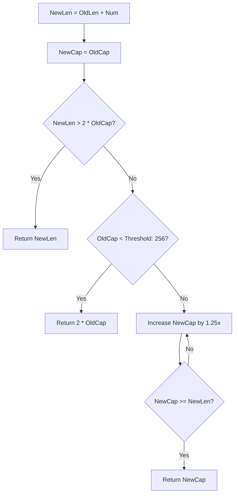

# 	Slice

## Slice structure

```go
type slice struct {
	array unsafe.Pointer
	len   int
	cap   int
}
```

## Grow slice



The new capacity needs to be aligned with Go's memory allocation strategy.

## Interception

| Operation      | `array`              | `len`            | `cap`            |
| -------------- | -------------------- | ---------------- | ---------------- |
| `s[start:end]` | points to `s[start]` | `end - start`    | `cap(s) - start` |
| `s[start:]`    | points to `s[start]` | `len(s) - start` | `cap(s) - start` |
| `s[:end]`      | points to `s[0]`     | `end`            | `cap(s)`         |

## Append

| **Case**                                | **Array (Pointer)**                           | **`len` (Length)**      | **`cap` (Capacity)**                   |
| --------------------------------------- | --------------------------------------------- | ----------------------- | -------------------------------------- |
| `append(s, value)` (Capacity Available) | **Unchanged**, still points to the same array | **Increases** (`len+1`) | **Unchanged** (`cap` remains the same) |
| `append(s, value)` (Capacity Exceeded)  | **Changes**, a new array is allocated         | **Increases** (`len+1`) | **grow slice**                         |

## Deep copy

```go
s1 := []int{0, 1, 2, 3, 4}
s2 := make([]int, 5)
copy(s2, s1)
// min(len(s1), len(s2))
```

## Delete an element?

```go
s := []int{0, 1, 2, 3, 4}
s1 := append(s[:1], s[2:]...)
// 0, 1, 2, 3, 4
//    2, 3, 4
// 0, 2, 3, 4, 4
```
